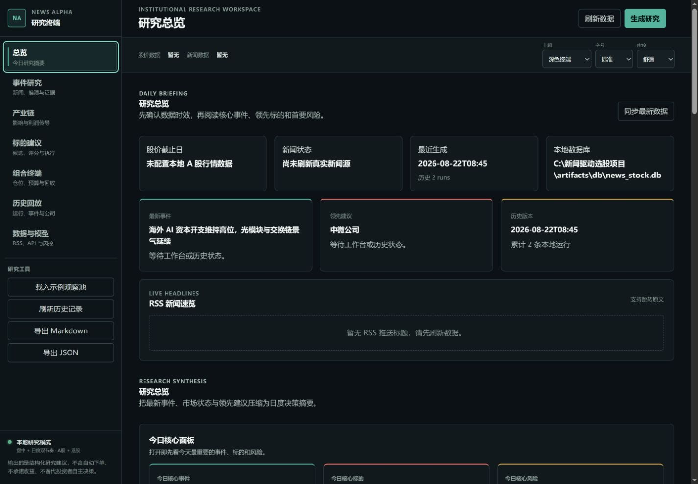
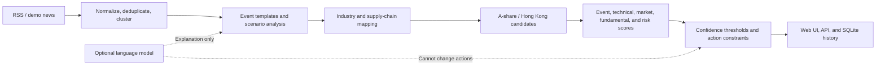

# News Alpha: News-Driven Stock Research Platform

**English** | [简体中文](README.zh-CN.md)

[](https://github.com/wangfan36/news-event-stock-platform/actions/workflows/ci.yml)
[](https://www.python.org/)
[](LICENSE)
[](CHANGELOG.md)



News Alpha is a local-first, explainable, and auditable news-event research workspace for A-share and Hong Kong stocks. It turns RSS news into structured events, maps them to industries, supply chains, and listed companies, and generates research recommendations using rule-based scoring with optional large-language-model enhancement.

> This project is provided for information organization, research assistance, and software demonstration only. It is not investment advice, does not connect to brokers or execute trades, and makes no promise of returns.

## Features

- Custom RSS sources: supports RSS 2.0 and Atom, one source per line, with whitespace cleanup, comment handling, and URL deduplication.
- Event scenarios: produces event stages, base/bull/bear paths, catalysts, monitoring points, and invalidation conditions.
- Supply-chain mapping: distinguishes direct beneficiaries, indirect beneficiaries, thematic exposure, adverse exposure, and unverified links.
- A/H company profiles: combines supply-chain position, event sensitivity, technical indicators, market position, and optional local fundamental data.
- Explainable recommendations: every conclusion retains a traceable `news -> event -> industry -> company` evidence chain and confidence threshold.
- Local persistence: RSS settings, run snapshots, and historical views are stored in local SQLite; runtime data is excluded from Git.
- Built-in web interface: hotspot overview, event details, supply-chain analysis, candidate stocks, recommendation cards, and historical replay in one workspace.

## Quick Start

Python 3.10 or later is required.

### Windows Setup

```powershell
git clone https://github.com/wangfan36/news-event-stock-platform.git
cd news-event-stock-platform
powershell -ExecutionPolicy Bypass -File .\scripts\setup.ps1
.\scripts\start.ps1
```

After installation, you can also double-click `start_local.bat`. Open [http://127.0.0.1:8000](http://127.0.0.1:8000) in your browser.

### Cross-Platform Setup

```bash
python -m venv .venv
# Windows: .venv\Scripts\activate
# macOS/Linux: source .venv/bin/activate
python -m pip install -e ".[dev]"
python -m news_alpha.webapp
```

No market-data file or model API is required for the first run. The application can execute the complete workflow with bundled demo news, the rule engine, and mock technical indicators.

## RSS and Models

Use one RSS source per line:

```text
URL | Name | Region | Market | Source Type
https://example.com/feed.xml | Example News | Global | A-share+Hong Kong | Financial Media
```

Only the URL is required. Spaces around `|` are allowed. Blank lines and lines beginning with `#` are ignored, and duplicate URLs keep only the first entry. Add sources under **Data & Models > RSS Sources**, then save the configuration and refresh data. See the [complete RSS and model setup guide](docs/rss-and-models.md) for validation rules and troubleshooting.

The language model is not the decision source. It may only enrich or refine structured text without changing the rule engine's action direction. OpenAI-compatible endpoints and Codex CLI are supported. Keep keys out of source files and set `NEWS_ALPHA_API_KEY` in the launch environment whenever possible; never commit a real key to `.env.example`.

## How It Works



The rule layer controls structure, mappings, scores, and action thresholds. The model layer provides constrained text enhancement. See the [architecture guide](docs/architecture.md) for modules, data objects, scoring, and fallback behavior. The original product scope is documented in [Product Requirements v1](docs/product-requirements.md).

## Configuration

Defaults live in `config/default.yaml`. Copy `config/local.example.yaml` to the Git-ignored `config/local.yaml` for machine-specific settings. Local market data is optional:

```yaml
artifacts_dir: artifacts
market_data:
  parquet_path: "D:/market-data/daily_prices.parquet"
  universe_path: "D:/market-data/universe.txt"
  price_override_path: artifacts/data/price_overrides.json
```

Available environment variables are listed in [.env.example](.env.example). Install the optional AKShare and Parquet integrations with:

```bash
python -m pip install -e ".[market]"
```

## Development

```bash
python -m pytest
ruff check news_alpha tests scripts
python scripts/check_secrets.py
python scripts/check_local_app.py
```

Repository layout:

```text
news_alpha/        Core engine, Flask API, frontend, and knowledge catalogs
config/            Portable defaults and local configuration example
tests/             News, event, recommendation, storage, and API tests
scripts/           Setup, startup, diagnostics, and catalog maintenance
docs/              Architecture, RSS specification, roadmap, and product scope
.github/           CI, issue forms, and pull-request template
```

## Current Limitations

This is a research alpha. The event knowledge base has limited coverage, and unknown events may appear in the news stream without producing complete recommendations. Target ranges and risk/reward estimates are rule-based heuristics rather than full valuation models. Real-time market data, regulatory filings, and historical performance attribution remain roadmap items. See the [roadmap](docs/roadmap.md) for details.

## License

News Alpha is **source-available for noncommercial use**, not OSI open-source software. Personal research, study, experiments, testing, and hobby use are permitted under the [PolyForm Noncommercial License 1.0.0](LICENSE) when there is no anticipated commercial application. Commercial use, including paid services, SaaS, client delivery, monetized workflows, and internal business operations, requires separate prior written permission.

Release `v1.0.0` and repository revisions through commit `0c895e8` remain available under the MIT terms originally distributed with them; the new license does not retroactively withdraw those permissions. Read the [complete licensing explanation](LICENSING.md), including permitted-use examples, the historical-version boundary, legal references, and third-party-rights notice.

Issues and pull requests are welcome. Read [CONTRIBUTING.md](CONTRIBUTING.md) before contributing, and report security concerns privately according to [SECURITY.md](SECURITY.md).
