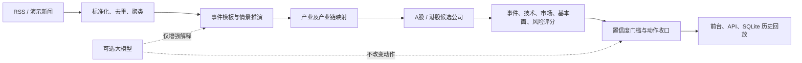

# News Alpha 新闻驱动选股平台

[English](README.md) | **简体中文**

[](https://github.com/wangfan36/news-event-stock-platform/actions/workflows/ci.yml)
[](https://www.python.org/)
[](LICENSE)
[](CHANGELOG.md)


一个本地优先、可解释、可审计的 A 股与港股新闻事件研究工作台。系统把 RSS 新闻整理为事件，映射到产业链和上市公司，再通过规则评分与可选大模型生成结构化研究建议。

> 本项目仅用于信息整理、研究辅助和软件演示，不构成投资建议，不连接券商，不自动下单，也不承诺收益。

## 核心能力

- 自定义 RSS：支持 RSS 2.0 与 Atom，每行一个源，自动清理空格、忽略注释并去重。
- 事件推演：输出事件阶段、基准/乐观/悲观路径、催化剂、观察点和失效条件。
- 产业链映射：区分直接受益、间接受益、主题映射、受损和待验证环节。
- A/H 公司画像：结合产业链位置、事件弹性、技术面、市场位置和可选本地财务数据。
- 可解释建议：每条结论保留“新闻 -> 事件 -> 产业 -> 公司”证据链与置信度门槛。
- 本地持久化：RSS、运行快照和历史观点保存在本机 SQLite；运行数据不会进入 Git。
- 自带前台：热点总览、事件详情、产业链、候选池、建议卡与历史回放集中在一个工作台。

## 快速开始

要求 Python 3.10 或更高版本。

### Windows 一键安装

```powershell
git clone https://github.com/wangfan36/news-event-stock-platform.git
cd news-event-stock-platform
powershell -ExecutionPolicy Bypass -File .\scripts\setup.ps1
.\scripts\start.ps1
```

也可以安装后双击 `start_local.bat`。浏览器地址为 [http://127.0.0.1:8000](http://127.0.0.1:8000)。

### 通用安装

```bash
python -m venv .venv
# Windows: .venv\Scripts\activate
# macOS/Linux: source .venv/bin/activate
python -m pip install -e ".[dev]"
python -m news_alpha.webapp
```

首次启动无需行情文件，也无需模型 API。系统会使用内置演示新闻、规则引擎和 mock 技术面运行完整链路。

## RSS 与模型

RSS 每行格式：

```text
URL | 名称 | 区域 | 市场 | 来源类型
https://example.com/feed.xml | Example News | 全球 | A股+港股 | 财经媒体
```

只有 URL 必填。分隔符 `|` 两侧可以有空格；空行与 `#` 开头的注释行会忽略；重复 URL 只保留第一条。请在 **数据与模型设置 > RSS 源** 中添加，保存全部配置后刷新数据。校验规则和排错方法见 [完整 RSS 与模型配置指南](docs/rss-and-models.zh-CN.md)。

大模型不是决策源，只能在不修改动作方向的前提下补充或润色结构化文本。系统支持 OpenAI 兼容接口和 Codex CLI。请勿把密钥写入源码，推荐在启动环境中设置 `NEWS_ALPHA_API_KEY`，且绝不能把真实密钥提交到 `.env.example`。

## 工作原理



规则层负责结构、映射、分数和动作门槛；模型层负责受约束的文本增强。详细模块、数据对象、评分机制与降级策略见 [架构说明](docs/architecture.md)。原始产品需求见 [产品需求 v1](docs/product-requirements.md)。

## 配置

默认配置位于 `config/default.yaml`，可将 `config/local.example.yaml` 复制为不会被 Git 跟踪的 `config/local.yaml`。本地行情完全可选：

```yaml
artifacts_dir: artifacts
market_data:
  parquet_path: "D:/market-data/daily_prices.parquet"
  universe_path: "D:/market-data/universe.txt"
  price_override_path: artifacts/data/price_overrides.json
```

可用环境变量见 [.env.example](.env.example)。如需 AKShare 与 Parquet 增强能力，安装：

```bash
python -m pip install -e ".[market]"
```

## 开发与测试

```bash
python -m pytest
ruff check news_alpha tests scripts
python scripts/check_secrets.py
python scripts/check_local_app.py
```

目录结构：

```text
news_alpha/        核心引擎、Flask API、前端与知识库
config/            可移植默认配置和本地配置示例
tests/             新闻、事件、推荐、存储和 API 测试
scripts/           安装、启动、诊断与知识库维护工具
docs/              架构、RSS 规范、路线图和产品需求
.github/           CI、Issue 与 PR 模板
```

## 当前边界

当前版本是研究型 alpha：事件知识库覆盖有限，未知事件可能只进入新闻流而无法形成完整建议；目标价与赔率是规则启发式结果，不是严格估值模型；实时行情、公告源和历史绩效归因仍需继续建设。详细计划见 [路线图](docs/roadmap.md)。

欢迎提交 Issue 和 Pull Request。贡献方式见 [CONTRIBUTING.md](CONTRIBUTING.md)，安全问题请按 [SECURITY.md](SECURITY.md) 私下报告。
